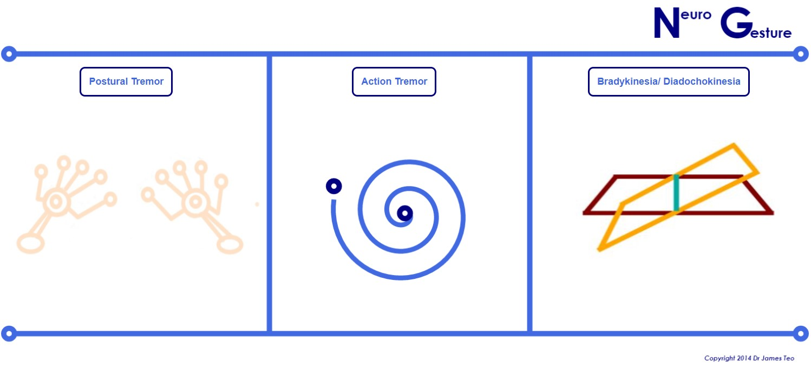

# NeuroGesture using LeapMotion
### Alpha version 0.21; 30 March 2014

Designed by Dr James Teo, Dr Brigitta Zics 
This software is an Alpha version using the LeapMotion SDK in 2014

NOTE: this was working on the Leap Motion Javascript and NOde.js in 2014, but the update to UltraLeap has broken it. 
Will need to fix dependencies to [node.js](https://github.com/nodejs), [three.js](https://github.com/mrdoob/three.js/) and such

